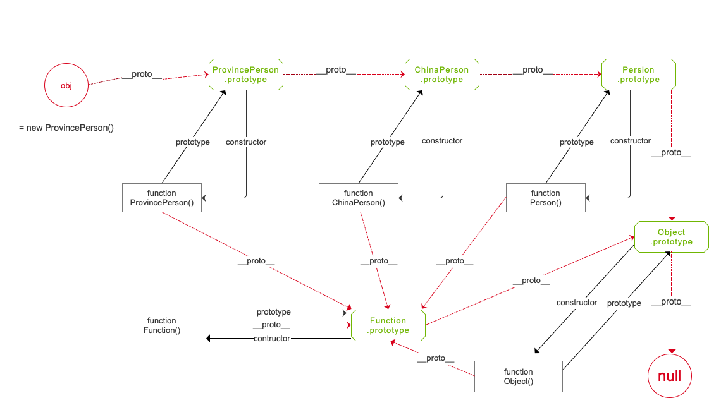

<!--
 * @Author: jerrychane
 * @LastEditors: jerrychane
 * @Date: 2021-09-23 23:06:09
 * @LastEditTime: 2021-09-30 06:45:21
-->
真正理解原型和原型链的关系，最好的方法莫过于整理一张流程图。绘制流程图的好处在于绘制的过程中，即检验自己对这个知识点的掌握程度，同时在绘制过程中加深对这个知识点的印象，理解更透彻。
为了更清晰地了解原型链的走向，可以先创建三个构造函数，建立 `多重继承` 关系，分别为 `Person` 、 `ChinaPerson` 、 `ProvincePerson` ，它们之间的继承关系为: `ProvincePerson` 继承 `ChinaPerson` ， `ChinaPerson` 又继承 `Person` 。
 

#### 一. 多重继承的代码

先贴上代码，每个子构造函数会在继承父级的基础上，分别在构造函数里面和原型里面，添加自己的自定义的属性和方法；另外在 `Person` 原型上写上和构造函数里同名的属性和方法，用来验证同名方法时，构造函数里的方法和原型上的方法哪个优先执行；在 `ProvincePerson` 上会重写从父级继承的方法，侧面大概展示一下面向对象的 `多态` 特性。

```js
/**
 * JavaScript多级继承和多态、原型和原型链
 **/
// 1.1 构造函数：Person(人)
function Person(name) {
    this.name = name ? name : "human";
    this.methodPerson = function() {
        console.log('Person构造函数里的方法methodPerson:' + this.name);
    }
    console.log("=================== Person 构造函数 初始化 ===================");
}
// 给 Person 原型上添加属性和方法
Person.prototype.age = 18;
Person.prototype.run = function() {
    console.log('Person 原型上的方法 run:' + this.name + ', age:' + this.age);
}
// 1.2 构造函数：ChinaPerson(中国人),继承于 Person
function ChinaPerson(name, skin) {
    Person.call(this, name); // 调用父级 Person 构造函数
    this.skin = skin ? skin : 'yellow';
    this.methodChinaPerson = function() {
        console.log('ChinaPerson 构造函数里的方法 methodChinaPerson skin:' + this.skin + ', tag:' + this.name);
    }
    console.log("=================== ChinaPerson 构造函数 初始化 ===================");
}
// 设置 ChinaPerson 原型指向 Person 原型，相当于 ChinaPerson 继承 Person
ChinaPerson.prototype = Object.create(Person.prototype);
// 设置新原型的构造函数指向自身
ChinaPerson.prototype.constructor = ChinaPerson;
// 给 ChinaPerson 的原型添加自定义的属性和方法
ChinaPerson.prototype.hero = 'Hua Mu Lan';
ChinaPerson.prototype.write = function() {
    console.log('ChinaPerson 原型里面的方法 write:唧唧复唧唧，木兰当户织! is who ?' + this.hero + ', tag:' + this.name + ', skin:' + this.skin);
}
// 1.3 构造函数: ProvincePerson(省城人)，继承 ChinaPerson
function ProvincePerson(name, skin, count) {
    ChinaPerson.call(this, name, skin);
    this.count = count ? count : 800;
    this.methodProvincePerson = function() {
        console.log('ProvincePerson 构造函数里面的方法 methodProvincePerson ---> count:' + this.count + 'w，skin:' + this.skin + 'tag:' + this.name);
    }
    // 重写从父级继承下来的方法 
    this.methodChinaPerson = function() {
        console.log('ProvincePerson 构造函数里重写父级方法 methodChinaPerson');
    }
    console.log("=================== ProvincePerson 构造函数 初始化 ===================");
}
// 设置 ProvincePerson 的原型执行 ChinaPerson 的原型，相当于 ProvincePerson 继承 ChinaPerson
ProvincePerson.prototype = ChinaPerson.prototype;
// 设置 ProvincePerson 的原型的构造函数指向自身
ProvincePerson.prototype.constructor = ProvincePerson;
// 给 ProvincePerson 的原型上添加自定义的属性和方法
ProvincePerson.prototype.feature = '武汉热干面';
ProvincePerson.prototype.eat = function() {
    console.log('ProvincePerson 原型里面的方法 eat ---> tag:' + this.name + ', like eat:' + this.feature + ', hero:' + this.hero + ', skin:' + this.skin);
}
// 重写从父级原型继承下来的方法
ProvincePerson.prototype.write = function() {
    console.log('ProvincePerson 原型里重写从父级原型继承的 write 方法!');
}
```

#### 二. 绘制原型链流程图

结合以上的代码，绘制构造函数原型链的关系，如下图：



对上图进行说明，和原型链知识进行归纳：

* `ProvincePerson`、`ChinaPerson`、`Person` 三个是自定义函数，`Function` 、`Object` 两个是系统构造函数; 
* 原型链方向(寻找父级方向)为:`ProvincePerson` ---> `ChinaPerson` --->  `Person` ---> `Ojbect` ---> `null`,  `Function` ---> `Object` ---> `null`; 
* 上图中`obj` 是构造函数`ProvincePerson` 的实例对象；`矩形` 表示 `构造函数`，`六边形` 表示构造函数的 `原型对象`，`红色虚线` 代表实例对象通过其`私有原型属性__proto__` 寻找父级原型走向; 
* `prototype` 是构造函数的属性,  `__proto__` 是构造函数的实例对象的属性；
  + 实例对象的`__proto__`属性指向该对象的构造函数的`prototype`属性，即`实例对象.__proto__ = 构造函数.prototype`; 
  + `__proto__` 是隐式原型，一般不建议直接使用，通常用 `Object.getPrototypeOf(obj)` 来获取实例对象的原型; 
  + 构造函数的`prototype` 和 实例对象的`__proto__` 都是对象; 
  + 使用 `new` 关键字调用的函数叫做`构造函数`，例如 `var obj = new ProvincePerson()`，此时`ProvincePerson` 即为构造函数，实际上是一个类模板；
  + 当函数不通过`new` 关键字调用，直接调用时，便是一个普通函数，例如`ProvincePerson()`、`Object()`、`Function()` ; 
  + 所有的普通函数都是构造函数`Function()`的实例对象，例如`Object、Function` 作为普通函数调用时，它们都是 `Function` 的实例对象; 
  + 这就是为什么函数既有`prototype` 属性，也有 `__proto__` 属性了，因为它们都有双重身份; 
  + 第一重身份是: 它们有可能会使用 `new` 关键字被调用，此时它们是构造函数，有 `prototype` 属性; 
  + 第二重身份是: 它们不使用 `new` 关键字直接调用，此时它们是构造函数 `Function` 的实例对象，这时候它们有 `__proto__` 属性; 
  + `Function` 作为一个特殊的存在，特殊之处在于 `Function.prototye = Function.__proto__`，即它作为构造函数的原型(`prototype`) 和 它作为普通函数的实例对象的原型(`__proto__`) 指向同一个对象; 
* 构造函数的原型的 `constructor` 属性指向构造函数，实例对象的 `constructor` 也指向构造函数，即 `构造函数.prototype.constructor = 构造函数 = 该构造函数的实例对象.constructor`; 
* 一个构造函数继承自父级构造函数，会拥有父级所有对外的，包括构造函数的属性和方法，和父级原型上的属性和方法；
* 子级构造函数可以对继承的属性和方法进行重写；如果构造函数里面的属性和方法，和它的原型上的属性和方法同名，则调用时优先使用构造函里面的属性和方法; 
* 所有的对象或构造函数通过原型链，追本溯源，最后的根对象都是`Ojbect` 。即所有的构造函数都是`Object`的子级或间接子级, `Object`的原型是`null` , 万物归无; 
以上即可原型链的核心，尽可能参考画图的方式加深理解。
#### 三. 测试代码验证
